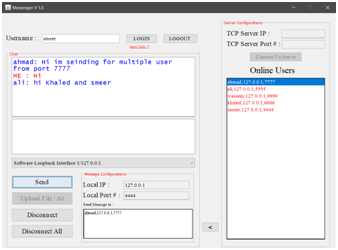

# Network 1 ( Peer to Peer  )
## Introduction 
A simple GUI application ( Peer to Peer ) that runs on a local Network , Using 
Java Apache NetBeans IDE 12.4 with JDK 16.1 . Divided to two parts 
* Part 1 : Implement P2P application chatting UDP socket in Java.
* Part 2 :  Implement TCP Java socket.
Will get all users are in fake database and show them in a list.
## GUI
* Main frame for chatting 

* Sign up  frame

* Server Side 

## Images 
after the user login he can select one from online users and press at arrow then select the user 
from send message to panel , you can type your message in second one text area and press send your 
message will appear in the first text area as shown

you can also send for multiple users in the same time

from other device 

 